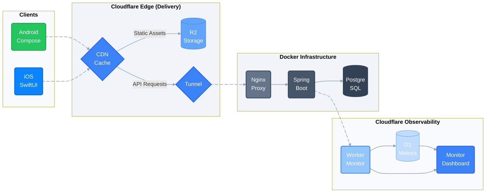

### Ryan Su 


- **Education:** *&nbsp;&nbsp;&nbsp;&nbsp;Mathematics & Computer Science (JMC) @ Imperial College London*
- **The Stack:** *&nbsp;&nbsp;&nbsp;&nbsp;Built **CoolLib** — a native cross-platform library management system. Engineered a containerized Kotlin & Spring Boot REST API backend alongside dual native mobile clients via Jetpack Compose and SwiftUI. Integrated a live telemetry and edge analytics pipeline using Cloudflare Workers & D1.*

&nbsp;&nbsp;&nbsp;&nbsp;&nbsp;&nbsp;
[](https://ryansu.uk/analytics/)&nbsp;&nbsp;&nbsp;&nbsp;
[](https://ryansu.uk/android-demo/)&nbsp;&nbsp;&nbsp;&nbsp;
[](https://ryansu.uk/ios-demo/)&nbsp;&nbsp;&nbsp;&nbsp;

---

### System Architecture


<a href="https://ryansu.uk/analytics/">
  
</a>

### Technical Stack

```text
Mobile:   Kotlin (Compose, Hilt, Room) • Swift (SwiftUI, Combine, SwiftData)
Backend:  Spring Boot • REST APIs • PostgreSQL • Actuator • JWT • Clean Architecture
Infra:    Docker • Nginx • CI/CD (GitHub Actions) • Containerized Deployment
Cloud:    Cloudflare Workers • D1 • R2 (S3 API) • Edge Computing • CDN • Zero Trust
```

<p>
  <!-- Ecosystem & Multiplatform -->
  &nbsp;
  &nbsp;
  &nbsp;
  
</p>
<p>
  <!-- Infra & Edge Computing -->
  &nbsp;
  &nbsp;
  
</p>
