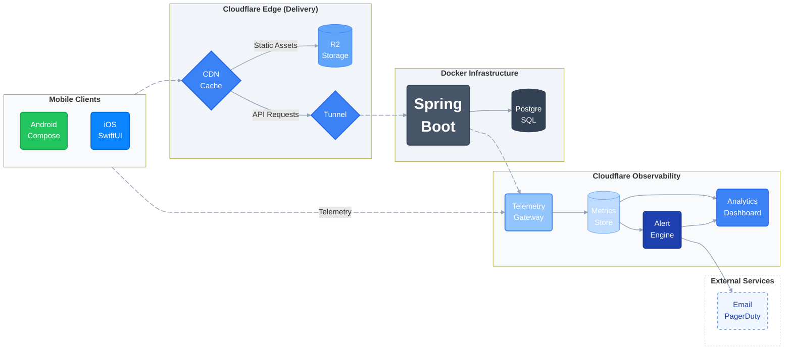

### Ryan Su


*Software Engineer specializing in mobile, backend, and cloud platforms. Built CoolLib, a distributed system combining native Android/iOS applications, Spring Boot microservices, Cloudflare edge infrastructure, real-time telemetry, and automated CI/CD delivery.*

<p align="left">
  <a href="https://ryansu.uk/analytics/infrastructure"></a>&nbsp;&nbsp;&nbsp;&nbsp;&nbsp;<a href="https://ryansu.uk/analytics/mobile"></a>&nbsp;&nbsp;&nbsp;&nbsp;&nbsp;<a href="https://ryansu.uk/analytics/github/"></a><a href="https://ryansu.uk/analytics/infrastructure"></a>&nbsp;&nbsp;&nbsp;&nbsp;&nbsp;<a href="https://ryansu.uk/analytics/mobile"></a>&nbsp;&nbsp;&nbsp;&nbsp;&nbsp;<a href="https://ryansu.uk/analytics/github/"></a>&nbsp;&nbsp;&nbsp;&nbsp;&nbsp;<a href="https://ryansu.uk/analytics/incidents/"></a>
</p>

<p align="left">
  <a href="https://ryansu.uk/demo/android-demo/"></a>&nbsp;&nbsp;&nbsp;&nbsp;&nbsp;<a href="https://ryansu.uk/demo/ios-demo/"></a>
</p>


---

### System Architecture



### EDGE PLATFORM TELEMETRY

<p align="left"><a href="https://ryansu.uk/analytics/"></a></p>

### DEVELOPMENT METRICS
<p><a href="https://ryansu.uk/analytics/"></a></p>


### Infrastructure Highlights

- Edge analytics pipeline using Cloudflare Workers + D1
- Live telemetry ingestion from Spring Boot Actuator
- Containerized deployment with Docker and Nginx
- CDN-backed static delivery via Cloudflare R2
- Native Android/iOS clients sharing unified backend services

### Technical Stack


```text
Mobile          Kotlin • Jetpack Compose • SwiftUI
Backend         Java • Spring Boot • PostgreSQL • REST APIs
Frontend        TypeScript • Astro
Cloud & Edge    Cloudflare Workers • D1 • R2 • CDN
Platform        Docker • Nginx • GitHub Actions • CI/CD
Observability   Telemetry Pipelines • Metrics • Logging
```

